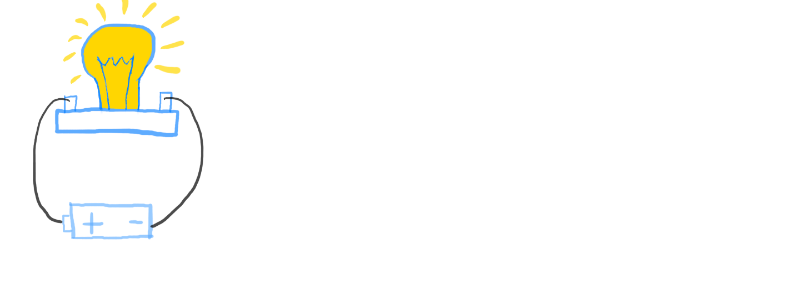
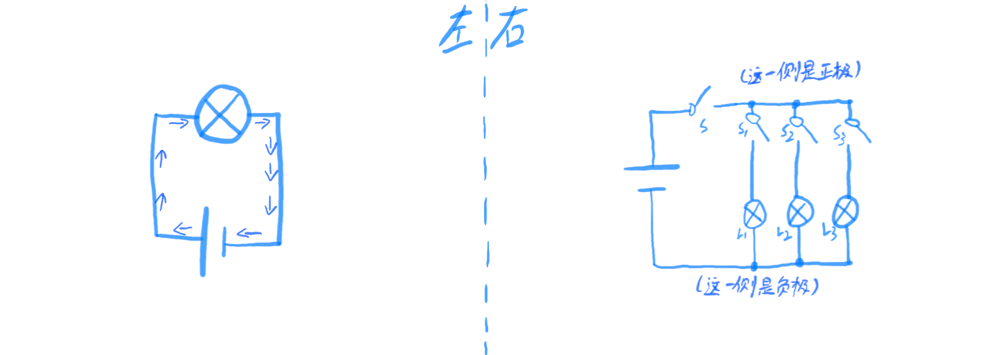

# 简明电学
## 01-点亮电灯
  
某天，觉得书桌在晚上写字时太暗。  
点蜡烛？又暗又费钱，一不小心碰倒了还会起火。  
同学，现在可是21世纪了！用电灯可是相当方便的！  

- 电灯？有一只。但是怎么用呢？  

看这个：  
  
这是电灯实物图。  

- 我认识，这是我们家以前用的那种！  

```
[注]随着照明技术的发展，越来越多家庭用上了日光灯、LED灯等。  
但是由于这些灯具内部电路较为复杂，因此暂不作研究。  
```

嗯，在画电路图时，为了简洁与高效，我们用这个来表示它：  
  

- 电路图和实物图有什么区别呢？  

电路图（也称原理图）是由实物图变化而来的。  
实物图虽然直观，但是不便于绘制与修改。若是复杂一些的电路，采用实物图会容易让人眼花缭乱，而简洁的电路图就好用很多。因此，电路图在电学中非常重要。  

- 看来电路图相当有用呢！  
- 可是要怎样点亮这只电灯泡呢？  

我们要给它供电（提供电能），电灯泡就会利用电能发光。  
在这个过程中，电灯会把电能转化为光能，从而可以照明。  

- 供电？怎么做？  

看到这两个接线柱：  
  
我们就要从这里供电。  
这是一个由电池组成的电源：  
  
电池里储存着电能。  

为了把电池中的电能传递给电灯，就要用到导线（也称电线）了。  
导线就像桥梁一样，在不同的元器件间传输电能。  
我们用导线把电源和电灯的两端分别连接起来，电源的正极连接电灯泡的正极，电源的负极连接电灯泡的负极。  
像这样：  
  
```
[注]电灯泡没有极性，因此无需区分电灯泡两端的正负极，任意连接即可。
```

- 灯亮了！  
- 终于不用忍受那昏暗的桌子了！  

且慢！这只是实物图！  
刚刚我们讲过电路图在电学中非常重要。  
就让我们画出这个电路的电路图吧。  
电路图的画法可以看作是把实物图中的导线变得横平竖直、整齐有序，然后将元件的实物图替换为对应的元件符号。  
```
[注]在初中乃至高中阶段，电路图一般将正极连出的线放在一侧，负极引出的线放在另一侧，如下方插图右图。  
```
本电路的电路图如下方插图左图：  
  
电流从电源的正极出发，按照图中箭头所示的路径，经过用电器（电灯泡）回到电源的负极。这样的电路称作闭合回路，也叫通路。  
